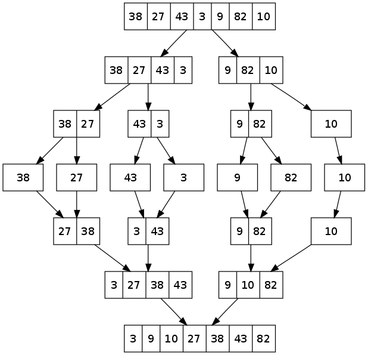
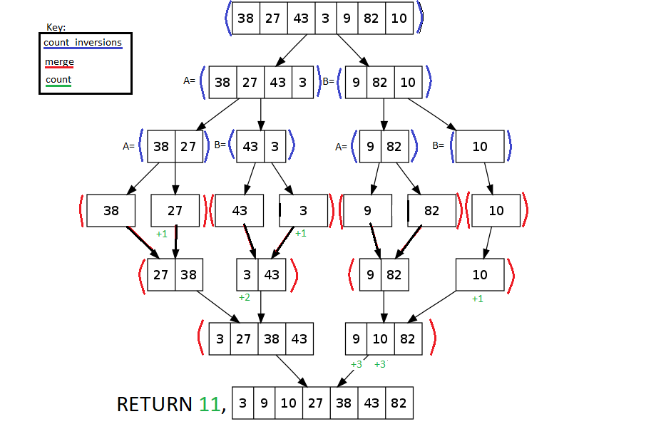

# Counting Inversions

This problem is discussed in [Dr. Gelfond Applied Algorithms](http://redwood.cs.ttu.edu/~mgelfond/FALL-2012/slides.pdf) and in [Geeks for Geeks](http://www.geeksforgeeks.org/counting-inversions/)


Category:

Difficulty to Understand:

## Problem
Given a person’s preferences (for books, movies, etc.)
match them with preferences of other people on the Web with
similar interests to provide a suggestion.

Preferences are often defined by rankings, labeling the objects
from 1 to n. So the problem is to define the distance between
two people's rankings. Calculate the number of inversions between each person's
rankings to represent the distance between them.

### Overview
Finding "similarity" or "distance" between two rankings. Given a sequence of n numbers 1..n (assume all numbers are distinct). Define a measure that tells us how far this list is from being in ascending order.
The value should be 0 if a_1 < a_2 < ... < a_n and should be higher as the list is more "out of order".

*Inversion*: _i_, _j_ form an inversion if a<sub>i</sub> > a<sub>j</sub>, i.e. if the two elements a<sub>i</sub> and a<sub>j</sub> are out of order.

We simply need to sort the list of preferences in ascending order and count the number of swaps we have to do.

### Input Format
A list of rankings [0, 1, 2, 3, 4, ...n]

### Constraints
Every number in the input list must be unique, a person can not give two items equal rankings.

### Output Format
- The original set
- The resulting count of inversions
- The newly sorted set

## Algorithm
### Overview
We will use a [Divide and Conquer](https://en.wikipedia.org/wiki/Divide_and_conquer_algorithm) algorithm. This type of algorithm is used in popular sorting algorithms like  quicksort and merge sort, as well as various other algorithms.
The algorithm consists of two functions, one to separate the original list into sub lists and another to sort and count inversions in each sub list.
It is almost identical to [merge sort](https://en.wikipedia.org/wiki/Merge_sort#Analysis), except for the extra part where we keep track of inversions we find.
Below is a graphical model of merge sort, this is exactly what our algorithm will do, as well as keep track of the inversions in the original list.




### Pseudo Code

```Python

def count_inversions(list s of preferences):
    """
    :returns: the number of inversions in s as well as sorted s
    """
    if the size of s is 1 then
        return 0 as the count of inversions and s as the set
    Divide s into two halves, A and B
    count_A, A = count_inversions(A)  # recursive call the first half
    count_B, B = count_inversions(B)  # recursive call the second half
    result, set = merge(A, B)  # count/merge the two halves together
    return count_A + count_B + result, S

def merge(list A, list B):
    """
    :returns: the number of pairs (X, Y) such that X is in A and
              Y is in B and X > Y, with the sorted list C containing
              elements of A and B.
    """
    int i, j = 0
    int count
    list C
    while both A and B are not empty:
        move the smaller of a[i] and b[j] to C
        if b[j] was smaller, then increase count by the size of A
        advance the pointer (i or j) of the smaller number's list
    Put the remainder of the non-empty list in C
    return count, C

```


### Analysis
Since the algorithm is only slightly different from the merge sort algorithm, it inherits the
merge sort time complexity which is:

- worst case: O(n log n)
- avg case: O(n log n)

## Example



----

## Conclusion
The number of inversions for two people who's preferences lists or 'rankings' get passed into our counting inversions
algorithm can be compared to see how 'far apart' their preferences are. If not very far apart, we could assume that the two
have a similar taste in the subject of which they were ranking.

Counting inversions by using merge sort by default sorts the input array. If we only wanted
to count inversions but keep the original array unsorted, we would need to create a copy of the original array and
call `counting_inversions` on it.
