# Segmented Least Squares

This problem is introduced in [Dr. Gelfond Applied Algorithms](http://redwood.cs.ttu.edu/~mgelfond/FALL-2012/slides.pdf) and is further discussed by [UMASS](https://people.cs.umass.edu/~sheldon/teaching/mhc/cs312/2013sp/Slides/Slides15%20-%20Segmented%20Least%20Squares.pdf) as well as other universities.

Category: Dynamic Programming

Difficulty: Hard

## Problem

Given _n_ points in the plane: _(x<sub>1</sub>, y<sub>1</sub>),  (x<sub>2</sub>, y<sub>2</sub>),..., (x<sub>n</sub>, y<sub>n</sub>)_.
Find **a sequence of lines** that minimizes _f(x) = E + cL_ where:
- _E_ is the sum of the sum of squared errors for each segment
- _L_ is the number of segments in the solution
- _c_ > 0 is a given constant

### Overview

To understand the problem of _Segmented least squares_ we must first understand the problem of _Least Squares_.
The notes over these two problems are taken from Princeton's lecture slides on them found above.

#### Least Squares

Given _n_ points in the plane: _(x<sub>1</sub>, y<sub>1</sub>),  (x<sub>2</sub>, y<sub>2</sub>),..., (x<sub>n</sub>, y<sub>n</sub>)_.
Find **a line** _y = ax + b_ that minimizes the sum of the squared error given by the equation:

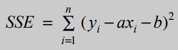

The SSE formula is minimized when the slope _a_ of the line and the y-intercept _b_ are found using:

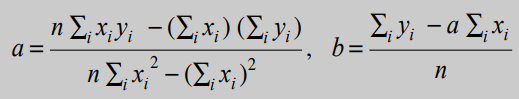

A Least Squares solution would look like this:

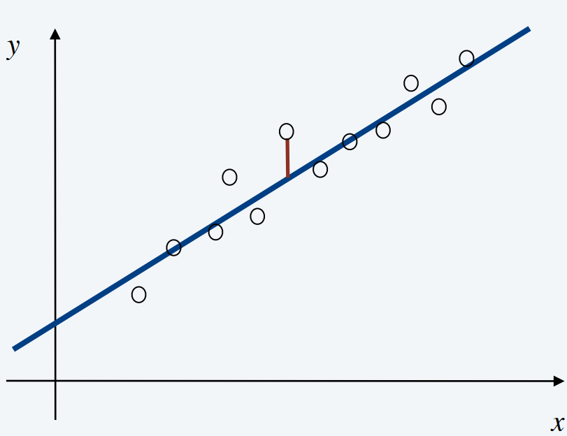

The red line from the point to the solution line is the error value for that point. The solution line minimizes the sum of all
of the error values for each point.

#### Segmented Least Squares

Given _n_ points in the plane: _(x<sub>1</sub>, y<sub>1</sub>),  (x<sub>2</sub>, y<sub>2</sub>),..., (x<sub>n</sub>, y<sub>n</sub>)_.
Find **a sequence of lines** that minimizes _f(x) = E + cL_ where:
- _E_ is the sum of the sum of squared errors for each segment
- _L_ is the number of segments in the solution
- _c_ > 0 is a given constant

The difference is is that here we are trying to find multiple "lines" or "segments" that
will minimize the sum of squared errors while also trying to balance how many segments we have (using the given _c_).

A Segmented least squares solution could look like this:

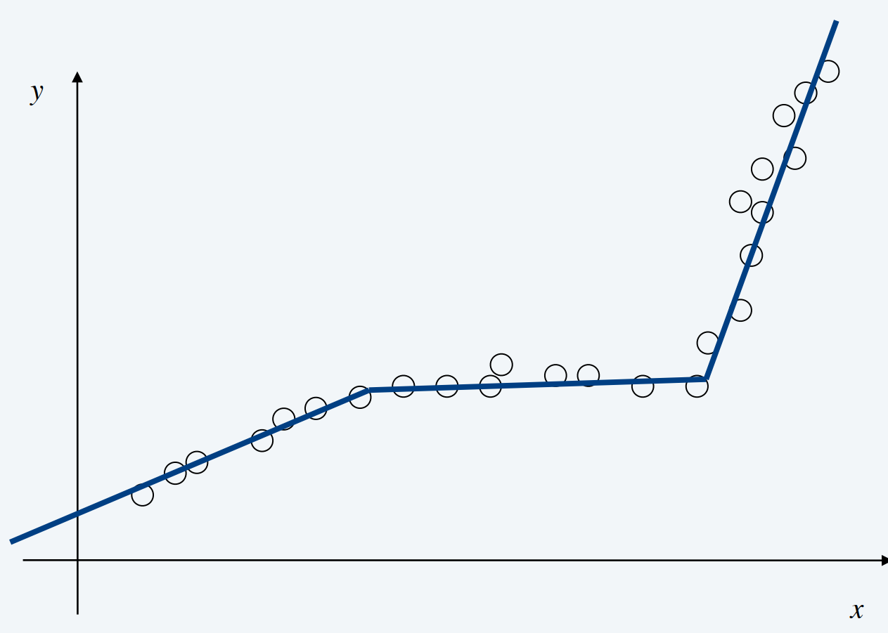

Another solution if the given _c_ value was really low could be:


As you can see, _c_ will control how many lines v.s. how accurate the fit is.

### Input Format

1. A list of points in _S_ where each point is in the format `[x, y]`. An example input would look like:
```Python
    [[10, 9], [3, 4], [5, 6]]
```
2. A constant _c_ > 0 which is the cost of adding a new segment to the optimal solution.

### Output Format

- the total "cost" of the optimal solution (i.e. the sum of the costs of the segments), and
- a visual graph depicting the points in _S_ and the segments in the optimal solution.

## Algorithm
### Overview
- _OPT(j)_ will denote the minimum cost for a segment through the points _p<sub>i</sub>,p<sub>i+1</sub>,...,p<sub>j</sub>_.
- _e(i,j)_ will denote the minimum sum of squared errors for points _p<sub>i</sub>,p<sub>i+1</sub>,...,p<sub>j</sub>_

To compute _OPT(j)_ we will use the formula:

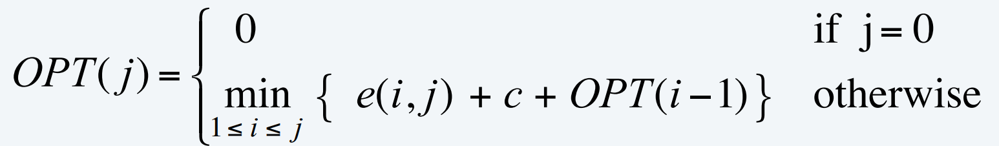

Where:
- _OPT(i)_ is the cost of the previous optimal segment through the points _p<sub>i`</sub>,p<sub>i+1</sub>,...,p<sub>i</sub>_,
- _c_ is the cost of adding a new segment and,
- _e(i,j)_ is the sum of squared errors for a segment running though points  _p<sub>i</sub>,...,p<sub>j</sub>_

Our algorithm is as follows:

1. Sort _S_ by x coordinates.
2. Compute _e(i,j)_ for every possible segment in _S_.
3. For each point _j_ in _S_, find _OPT(j)_, storing the value in array _m_.
4. Since _m_ keeps track of the accumulating costs of the optimal segments in the solution, the cost of the optimal solution will be in the last element of _m_.

It should be noted that in our solution file we include some variables for keeping track of the points that exist in the optimal solution for the purpose
of plotting them visually later.

### Pseudo Code

This pseudo code follows the above algorithm and returns the cost of the optimal solution. As stated previously, in the
actual implementation there are a few more steps so that the optimal solution can be graphed.

````Python
    def segmented_least_squares(points, c):
        sort(points)  # sort by x values
        n = len(points)

        # Compute Sum of Squared Error for each segment
        for j = 1 to n:
            for i = 0 to j:
                compute the least squares error e(i,j) for the segment pi, pi+1,...,pj

        # Compute cost of optimal segment
        m[0] = 0  # initialize array with 0 cost
        for j = 1 to n:
            for i = 0 to j:
                m[j] = min(e(i,j) + c + m[i])  # m[j] is the minimum costing segment for the points pi to pj

        return m[n-1]
````
## Analysis

The segmented least squares algorithm has a time complexity of O(n<sup>3</sup>):
- O(n<sup>3</sup>) for finding all _e(i,j)_ values + O(n<sup>2</sup>) for finding all _OPT(j)_ values.

and a space complexity of O(n<sup>2</sup>).

This time complexity can be improved to O(n<sup>2</sup>) time and O(n) space by pre-computing
various statistics.


## Example

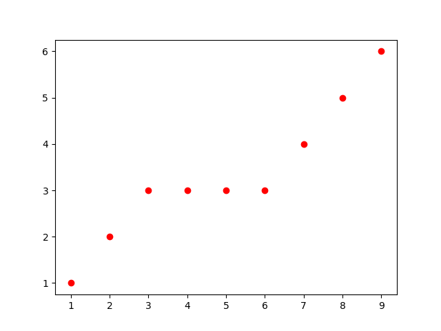

Our example points will be
```
        [1, 1],
        [2, 3],
        [4, 4],
        [5, 6],
        [7, 9]
```
and our `c` value will be `c = 0.5`

The first step in our algorithm is to find _e<sub>ij</sub>_ for each segment _p<sub>i</sub>,...p<sub>j</sub>_ in _S_

Recall that to do this we will have to calculate:


where


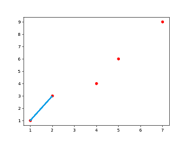

For the segment p<sub>0</sub>,...p<sub>1</sub>, _e<sub>01</sub>_ = 0.0

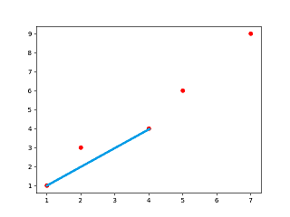

For the segment p<sub>0</sub>,...p<sub>2</sub>, _e<sub>02</sub>_ = 0.643

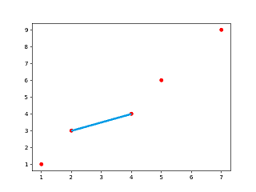

For the segment p<sub>1</sub>,...p<sub>2</sub>, _e<sub>12</sub>_ = 0.0

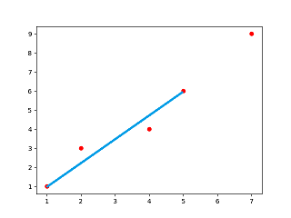

For the segment p<sub>0</sub>,...p<sub>3</sub>, _e<sub>03</sub>_ = 0.9

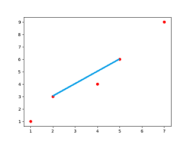

For the segment p<sub>1</sub>,...p<sub>3</sub>, _e<sub>13</sub>_ = 0.643

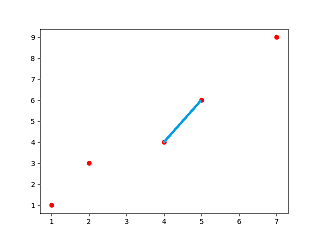

For the segment p<sub>2</sub>,...p<sub>3</sub>, _e<sub>23</sub>_ = 0.0

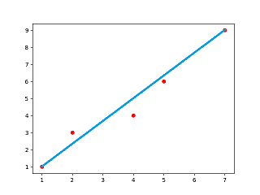

For the segment p<sub>0</sub>,...p<sub>4</sub>, _e<sub>04</sub>_ = 1.3246

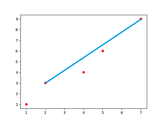

For the segment p<sub>1</sub>,...p<sub>4</sub>, _e<sub>14</sub>_ = 1.3077

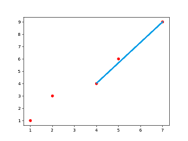

For the segment p<sub>2</sub>,...p<sub>4</sub>, _e<sub>24</sub>_ = 0.071

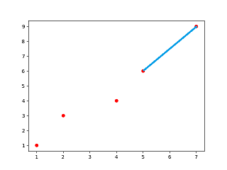

For the segment p<sub>3</sub>,...p<sub>4</sub>, _e<sub>34</sub>_ = 0.0


Next we will compute the optimal solution using _OPT(j)_. We will initialize
our optimal cost array with _m[0] = 0_.

The first segment we will evaluate is _p<sub>0</sub>...p<sub>1</sub>_.

- _m = [0]
- _m[1] = OPT(1) = min<sub>0<=i<1</sub>(e(0,1) + 0.5 + OPT(i))_
- - `i = 0, j = `, cost = 0.0 + 0.5 + 0 = 0.5
- _m[1] = min(0.5) = 0.5


## Conclusion


