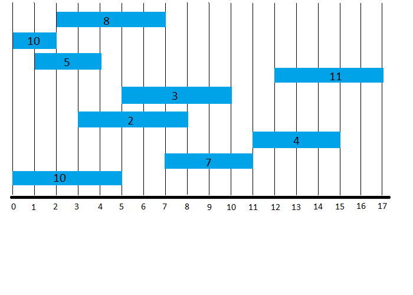
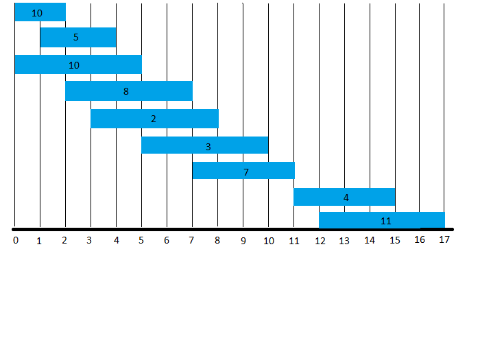

# Shortest Path Tree in a Graph

This problem is introduced in [Dr. Gelfond Applied Algorithms](http://redwood.cs.ttu.edu/~mgelfond/FALL-2012/slides.pdf) and is further discussed by [Washington University](https://courses.cs.washington.edu/courses/cse521/13wi/slides/06dp-sched.pdf)

This problem is a vriation of the simpler [Interval Scheduling](../../Greedy/Educational/Interval Scheduling) problem that can be solved using a greedy algorithm.

Category: Dynamic Programming

Difficulty: Hard

## Problem
Given _n_ requests where each request _i_ has an associated interval _[s<sub>i</sub>, f<sub>i</sub>)_ and has a weight/value
_v<sub>i</sub>_, and one server, select a subset of mutually compatible requests with maximum weight/value.

### Overview
Ordering intervals by the earliest finishing time like we did in the [Interval Scheduling](../../Greedy/Educational/Interval Scheduling) solution does not work.
Later intervals may not be compatible with the current one and may have much higher weights.

First we must solve a simpler problem - finding the maximum sum of weights. To do this we will use a helper function `opt()` that will return
an array containing the max value for a schedule containing j and not containing j for each request j.

### Input Format

A list of requests R such that each request _i_ has a start time _s<sub>i</sub>_, a finish time _f<sub>i</sub>_ a value or weight _v<sub>i</sub>_ and an index
of the first previous request compatible with _i_.

### Constraints
The input list of requests must be sorted by finish time before the main part of our algorithm.

### Output Format
The output will be a list of indices of the requests in the optimal schedule. If the sorted list of request is [A, C, B, E, D, G, F] and the optimal
schedule is [C, D, F], our algorithm will return [1, 4, 6].

## Algorithm
### Overview
Finding an optimal schedule of weighted intervals has a few steps:
1. Sort the requests by finish time
2. Find _p(j)_ for each request _j_ where _p(j)_ is a request _i < j_ that is compatible with _j_.
3. Find the value of optimal schedules containing _j_ and not containing _j_ for every request _j_.
4. Using the list from step #3, find the schedule with the max sum of request values.

So the trickiest part here is step #3. Basically to accomplish this we loop through each request _r_ in the set of requests _R_ and see if _r_ plus its previous
compatible request values is bigger than the request before it plus its previous compatible request values. The easiest way at this point to understand this is just by seeing
its implementation and pseudo code.


### Pseudo Code

```Python

   def opt(requests: set of requests scheduled by finish time):
        m = []
        m[0] = 0  # the first request has no previous requests.. so its opt is 0
        for i from 1...len(requests):
            # m[i] is the max between this request and its previous compatible
            # requests, and the previous set of compatible requests.
            m[i] = max(value of i + m[p(i)], m[i-1])
        return m

   def find_solution(m, i):
        # i is the last index in the array of requests
        if i == 0:
            return [i]
        if value of request at index i + m[p(i)] > m[i-1]:
            return find_solution(m, p(i)) + [i]
        return find_solution(m, i-1)

```

## Analysis
The time complexity of the algorithm in is O(n). Sorting the requests before finding the optimal solution is O(n log n), but each step after that (finding previous indices, finding the optimal values, and finding the requests) are O(n).

## Example


We start with 9 unsorted requests. To find an optimal schedule we will need to first
sort them by finish time.



Now that they are sorted we can start parts of our algorithm. We need to find out _p(j)_ for every request _j_.
Remember that _p(j)_ is the request _i < j_ that is compatible with _j_.

Here is a table detailing each request _j_ and _p(j)_:

| Request       | j  |  v(j) | p(j) |
| ------------- |----| ----- |----- |
| (0, 10, 2)    | 1  |   10  | 0   |
| (1, 5, 4)     | 2  |   5   | 0   |
| (0, 10, 5)    | 3  |   10  | 0   |
| (2, 8, 7)     | 4  |   8   | 1   |
| (3, 2, 8)     | 5  |   2   | 1   |
| (5, 3, 10)    | 6  |   3   | 3   |
| (7, 7, 11)    | 7  |   7   | 4   |
| (11, 4, 15)   | 8  |   4   | 7   |
| (12, 11, 17)  | 9  |   11  | 7   |

I know I know, arrays start at 0. A _j_ value of 1 is simply representing the first request. This will help us later in the algorithm.

So the first three requests in our sorted requests do not have any previously compatible requests, and thus have _p(j)_ = 0. The request `(2, 8, 7)` is compatible with request 1, so it's _p(j)_ = 1,
and so on.

Next we need to determine the maximum values for a schedule that we can get by following each request through their subsequent compatible requests.

| Request       | j  |  v(j) | p(j) |  m[j]  |
| ------------- |----| ----- |----- | ------ |
|               | 0  |   0   |  -   |   0    |
| (0, 10, 2)    | 1  |   10  |  0   |   10   |
| (1, 5, 4)     | 2  |   5   |  0   |        |
| (0, 10, 5)    | 3  |   10  |  0   |        |
| (2, 8, 7)     | 4  |   8   |  1   |        |
| (3, 2, 8)     | 5  |   2   |  1   |        |
| (5, 3, 10)    | 6  |   3   |  3   |        |
| (7, 7, 11)    | 7  |   7   |  4   |        |
| (11, 4, 15)   | 8  |   4   |  7   |        |
| (12, 11, 17)  | 9  |   11  |  7   |        |

_m[j]_ will represent the maximum value of a scheduling solution for the items 1...j. This is found by using the relation:
```
    m[j] = max(v(j) + m[p(j)], m[j-1])
```

The first index of _m[]_ is initialized with the value 0. This allows us to say that the first request (at index 1) has no previous scheduling solution/value (a schedule has not been made).

So, _m[1_] will be the maximum of 10 + 0, and 0. (pssst.. its 10). Lets continue filling out _m[]_.

_m[2]_ for request j = 2 will still be 10, because its evaluation was `m[j] = max(v(j) + m[p(j)], m[j-1])` = `m[j] = max(5 + 0, 10)`.


| Request       | j  |  v(j) | p(j) |  m[j]  |
| ------------- |----| ----- |----- | ------ |
|               | 0  |   0   |  -   |   0    |
| (0, 10, 2)    | 1  |   10  |  0   |   10   |
| (1, 5, 4)     | 2  |   5   |  0   |   10   |
| (0, 10, 5)    | 3  |   10  |  0   |   10   |
| (2, 8, 7)     | 4  |   8   |  1   |   18   |
| (3, 2, 8)     | 5  |   2   |  1   |   18   |
| (5, 3, 10)    | 6  |   3   |  3   |   18   |
| (7, 7, 11)    | 7  |   7   |  4   |   25   |
| (11, 4, 15)   | 8  |   4   |  7   |   29   |
| (12, 11, 17)  | 9  |   11  |  7   |   36   |

Now all that is left to do is take a bottom-up approach using _m[]_ to find the requests in our solution schedule that gave us the maximum value in _m[]_ (which is 36).

In our first iteration of `find_solution(m, 9)`, we have the request (12, 11, 17). Its value in _m[]_ (36) is greater than _m[9-1]_ so we append it's index to the solution
list and recursively call `find_solution` behind it, i.e.:

```python
    if v(i) + m[p(i)] > m{i-1]:
        return find_solution(m, p(i)) + [i] # append index i to solution
```

This will cause find_solution to go down a path of previously compatible requests that resulted in the maximum schedule value of 36.


When index _i_ finally reaches 0, it will reach our base case and return all the way
up the call stack, giving us the resulting list of indices `[0, 3, 6, 8]`.

## Conclusion

The `compute_previous` and `opt` steps of this algorithm can be a little confusing, especially in the implementation. This is due to the shift in index between the two functions, necessary
because of the 0<sup>th</sup> index that is needed in _m[]_ for those requests who do not have previous compatible requests. However, the pseudocode is easy to follow and understand once you
figure out and trace all of the _p(j)_ values and every index of _m[]_.
