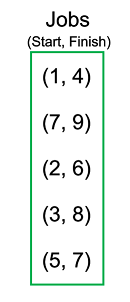
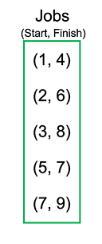
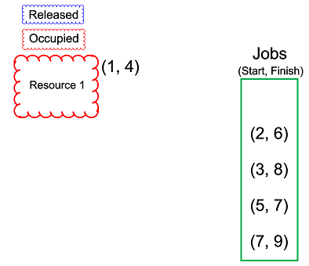
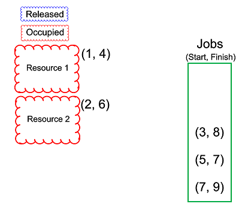
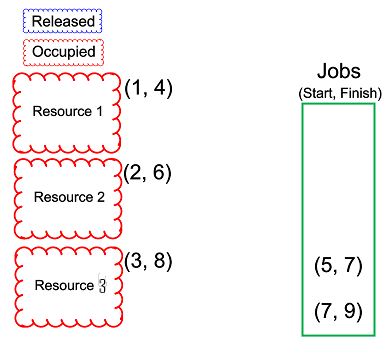
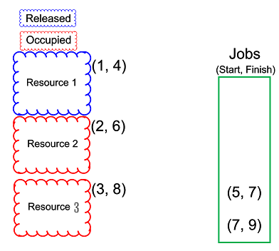
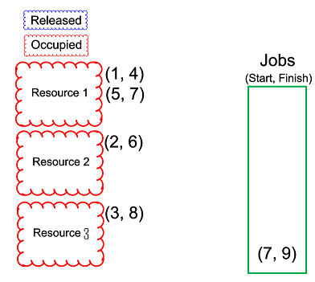
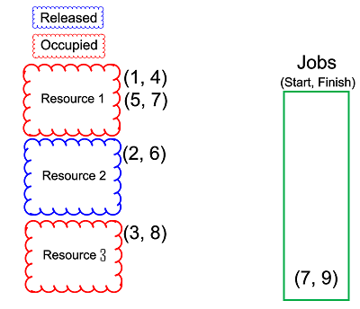
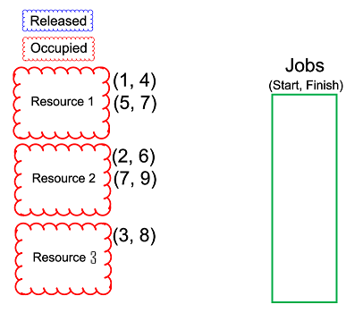

# Interval Partitioning

This problem is introduced in [Dr. Gelfond Applied Algorithms](http://redwood.cs.ttu.edu/~mgelfond/FALL-2012/slides.pdf).

Category: Greedy

Difficulty: Medium


## Problem

Given a set _J = {i<sub>1</sub> . . . , i<sub>n</sub>}_ of jobs where each request _i_ is
associated with an interval _[s(i), f(i)_] and each request requires one
of many available resources in _R_, schedule all jobs using as few resources as possible.

### Overview

Examples of this problem would be: scheduling classes using as few classrooms as possible (here, classrooms are the resources), or
allocating printing jobs using as few printers as possible (the printers are the resources), etc.

So we have a set of resources and a set of jobs that have a start time _s(i)_ and a finish time _f(i)_, and we need to complete all of
these jobs while using as few resources as possible. If I have a request that starts at 12:00PM and finishes at 2:00PM, and another that
starts at 3:00PM and finishes at 4:00PM, I will only have to use one resource because the two jobs do not overlap. However, if the second request were
to start at 1:30PM, I would then need to use two resources because the two jobs overlap.

Likewise, if we have a set of jobs:

    J = [ (12PM, 3PM), (2PM, 5PM), (4PM, 6PM) ],

we would then need to use at least 3 resources because all three jobs overlap.
From this we can draw the conclusion that the amount of resources we need will be equal to the amount of jobs in _J_ that overlap.

## Algorithm
### Overview

Since each request will have a definitive start time and finish time, it makes sense that we schedule the jobs that start the earliest
first. As we move from request to request in increasing order of start time, we can use resources that are free but that have already been used by
previous jobs, and if none are available we will have to use another available resource from _R_. This will split our resources up into three categories:
ones that are in use (occupied), ones that have been used but are now free (released), and ones that have not been used and are free (R). If possible
we would like to select our resource from released.

### Pseudo Code

```Python

    def interval_partitioning(set J: jobs):
        released = []
        occupied = []
        resources = [] # jobs being served by resource r where r is the index
        r = 0 # resource pointer
        1. Sort J by starting time
        2. For every j in J:
            a. move all resources in occupied that finished before the start of j into released
            b. if released is not empty:
                i. r = get resource from released
            c. else
                i. r = next resource in R
            d. move r into occupied
            e. put j into R[r]
        3. return R

```


### Analysis

Interval partitioning - much like interval scheduling - will have a time complexity dependent on the sorting algorithm used within it. In our implementation,
quicksort has a best and average time complexity of O(n log n) and a worst case of O(n<sup>2</sup>). All that is done in interval partitioning after
the pre-sort is a loop n times through the set of jobs, placing each job in the list R at index of what resource it is assigned to. This means that - even in edge
cases where each job overlaps all preceding jobs - our interval partitioning time complexity is equivalent to that of the sorting algorithm used.
A faster sorting algorithm such as Radix sort which has a time complexity of O(kn) where k is the number of requests to be sorted, or
counting sort which is O(N + k) where k is the range of the requests to be sorted, would both cause Version 2 to have a time complexity of O(n).

## Example

**1. Jobs to be scheduled**

5 jobs are to be spread among as few resources as possible.



**2. Jobs sorted by start time**

Jobs are sorted by start time using quicksort



**3. First job scheduled**

The first job is assigned to resource 1 which is new.



**4. Second job scheduled**

The second job is assigned to new resource 2, due to resource 1 being occupied.



**4. Third job scheduled**

The third job is assigned to new resource 3, due to resources 1 and 2 being occupied.



**5. First resource released**

Before the start time of job 4, job 1 finishes using resource 1, and resource 1 is now released.



**6. Fourth job scheduled**

The fourth job is scheduled on the newly released resource 1.




**7. Second resource released**

Before the start time of job 5, job 2 finishes using resource 2, and resource 2 is now released.




**6. Fifth job scheduled**

The fifth job is scheduled on the newly released resource 2.



**Done**

## Conclusion
The interval partitioning algorithm is greedy and yet yields an optimal solution by pre-sorting jobs by their start time.
